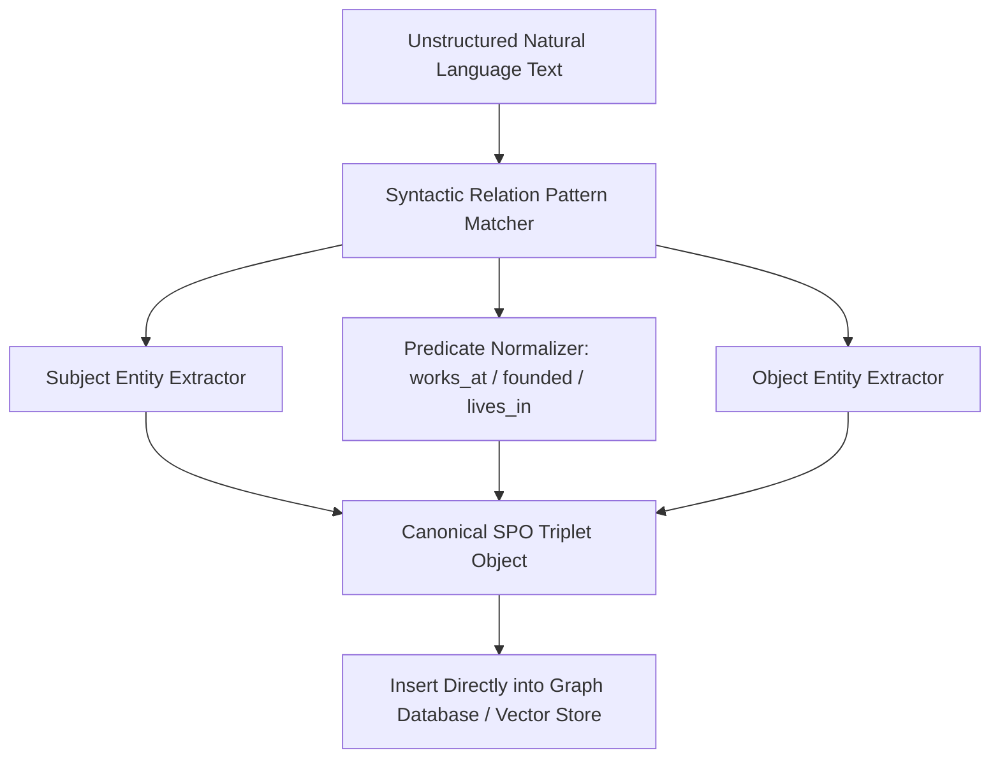

# GenPark AI Agent Skill - Knowledge Triplet SPO Extractor

Extracts formal (Subject, Predicate, Object) relationship triplets from natural language text to populate knowledge graphs.

Verified by [GenPark AI](https://genpark.ai) and compatible with [Model Context Protocol (MCP)](https://genpark.ai/mcp).

## Architecture Diagram

## Features
- **Structured Knowledge Distillation**: Converts prose into queryable graph nodes and edges.
- **Zero External Dependencies**: Pure Python standard library `re`.
